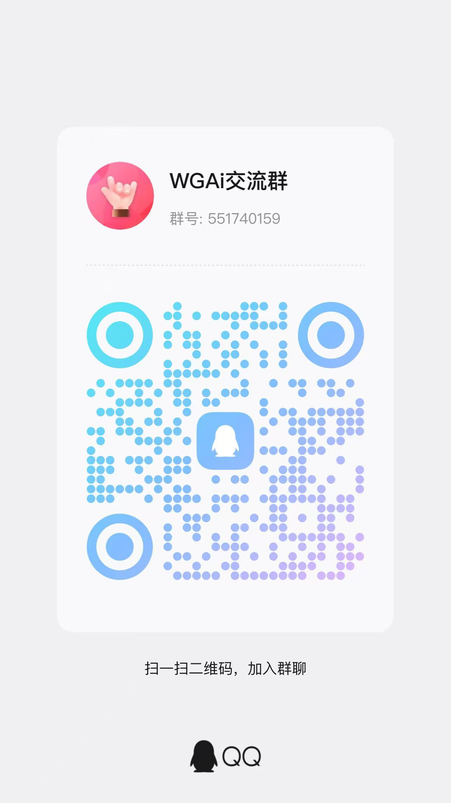

  

<h1 align="center">WGAI - Out-of-the-box Multimodal WebAI Platform</h1>

  <a href="README.md">中文文档</a> | <a href="README_EN.md">English Document</a>

  <b>Official Website: <a href="http://120.48.51.195/#/">http://120.48.51.195/#/</a></b>

  
  
  
  

---

## 🎡 Project Introduction
**WGAI** is a comprehensive AI management platform integrating multiple kernels such as OpenCV, YOLO, OCR, Face Recognition, and Speech Recognition. It supports AI intelligent customer service, Large Language Models (LLM), and digital human customization.
* **Architectural Advantage**: Training and inference are completely separated, effectively avoiding excessive Memory and GPU consumption. Supports autonomous offline deployment.
* **Core Features**: Online annotation & training, edge video analysis (16-64 channels real-time), and full-stack server support for Voice/OCR/ChatGPT/Digital Human.

## 📢 Business Cooperation
> **【Advertisement Slots Available】**
> We welcome cooperation from AI ecosystem partners, hardware manufacturers, and computing power service providers.
> **Contact:** Email: 1552138571@qq.com

---

## 💎 Technical Support & Community (Primary Channel)

As maintaining the project requires significant effort, **Knowledge Planet (ZhiXing) is currently the only paid support point**.

> 🛠️ **Service Rules:**
> * **GitHub / Gitee Issues**: Replied to occasionally; mainly used for Bug tracking.
> * **Knowledge Planet**: **【Guaranteed Response】**. Online during working days **AM 9:00 - PM 18:00 (UTC+8)**.
> * **Value**: Provides complete implementation tutorials and private model training guides. Code is unrestricted—advanced users can read and use the source code directly.

  
   
  <b>Scan to join Knowledge Planet for professional technical support</b>

| Official WeChat (Please state purpose) | Developer QQ Group |
| :---: | :---: |
|  |  |
| *Technical Consulting / Business* | *Daily Developer Exchange* |

---

## 🎬 Demo Videos
| Topic | Link |
| :--- | :--- |
| 📺 **Platform Overview** | [View Here](https://www.bilibili.com/video/BV1Pcq5B6EJY/) |
| 📺 **Annotation & Model Training** | [View Here](https://www.bilibili.com/video/BV13C9BYiEFS/) |
| 📺 **How to Use Trained Models** | [View Here](https://www.bilibili.com/video/BV1fJwhe7E1G/) |
| 📺 **OCR & License Plate Recognition** | [View Here](https://www.bilibili.com/video/BV1Dn2wBzEHg) |
| 📺 **Online Speech Recognition** | [View Here](https://www.bilibili.com/video/BV1Dn2wBzENj) |
| 📺 **Real-time Video Analysis** | [View Here](https://www.bilibili.com/video/BV1gn2wB6EQN/) |
| 📺 **End-to-end Training Process** | [View Here](https://www.bilibili.com/video/BV1EJwheEEYq/) |
| 👤 **Digital Human Dynamic Demo** | [Download to View](https://img.nj-kj.com/zhangwei_1745562613859_1745465917540_1745567724504.mp4) |

---

## 🖼️ Feature Showcases

### 1. Model Training & Online Annotation
| Model List Dashboard | Online Annotation System |
| :---: | :---: |
|  |  |
| **Real-time Training Logs** | **Training Result Evaluation** |
|  |  |

### 2. Video Analysis & Recognition
| Real-time Video Alert | Static Image Recognition |
| :---: | :---: |
|  |  |
| **Multi-color License Plate Recognition** | **High-precision OCR Extraction** |
|  |  |

### 3. Speech & Intelligent Dialogue
| Speech Hotword Config | Recognition Backend Status |
| :---: | :---: |
|  |  |
| **Audio Binding Management** | **ChatGPT Scoped Dialogue** |
|  |  |

### 4. System Management & API
| Backend Monitoring (CPU/JVM/Redis) | Third-party API Config |
| :---: | :---: |
|  |  |
| **Model Library Management** | **Alert Message Subscription** |
|  |  |

---

## 🚀 Quick Start

### 1. Source Code
* **Gitee**: [https://gitee.com/dromara/wgai](https://gitee.com/dromara/wgai)
* **GitHub**: [https://github.com/dromara/wgai](https://github.com/dromara/wgai)
* **GitCode**: [https://gitcode.com/dromara/wgai](https://gitcode.com/dromara/wgai)

### 2. Deployment
* **Demo URL**: [http://1.95.152.91:9999/](http://1.95.152.91:9999/) (User: `wgai` / Pass: `wgai@2024`)
* **Frontend**: Switch to `VUE` branch, run `npm install` && `npm run serve`.
* **Backend**: SpringBoot standalone. Manually import private JARs from the `resources` directory to your Maven repository.

---

## ☕ Donation
If this project has saved you time, please consider buying the author a coffee. **Donations > 100 RMB (approx. $15) will receive an "AI Secret Manual" (Limited to first 100 users)**.

| WeChat Pay | Alipay |
| :---: | :---: |
|  |  |

**Recent Donors:** @喜 | @小白

---

## 🛡️ License
[`Apache License, Version 2.0`](https://www.apache.org/licenses/LICENSE-2.0.html)