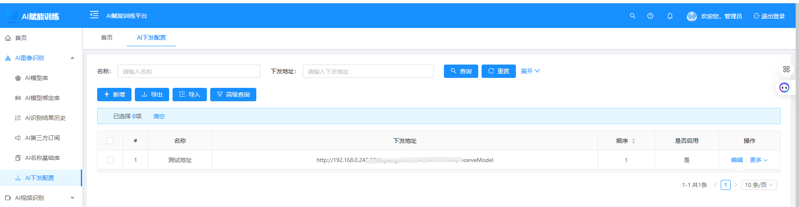
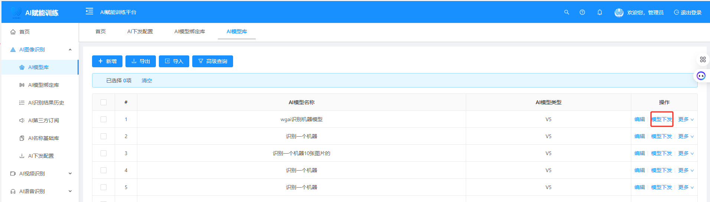
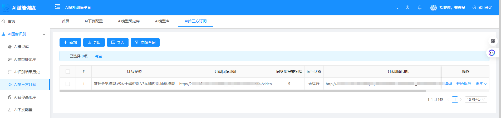

***

### **WGAI训练平台V2.0重磅发布：一键模型分发、跨平台共享、第三方无缝接入，开启智能协作新时代！**

**——Dromara开源社区再添企业级AI利器**

#### **引言**

在AI技术高速迭代的今天，如何实现模型训练与推理的高效协同，降低企业智能化转型门槛？WGAI训练平台作为Dromara开源生态中专注AI开发的核心工具，始终以“**简化流程、赋能协作**”为目标。本次V2.0版本升级，我们聚焦**模型分发效率**、**资源协作共享**与**生态开放兼容**三大方向，带来更贴合企业需求的解决方案！

***

### **一、核心升级亮点解析**

#### **1. 模型一键下发：1台训练机，N台推理机，资源利用率提升300%**

*   **功能说明**：支持将训练完成的模型**一键下发至任意推理平台**，实现“训练-推理”链路自动化。无论是边缘设备还是云端集群，均可通过平台界面快速配置部署路径，告别手动导出与脚本上传的繁琐操作。
*   **技术优势**：
    *   基于动态资源调度算法，自动适配不同推理框架（如TensorFlow Serving、ONNX Runtime等）的接口需求。
*   **用户价值**：企业可灵活扩展推理算力，快速响应业务高峰，同时减少训练资源闲置成本。
    

#### **2. 模型共享协作：跨平台资源互通，构建企业AI资产池**

*   **功能说明**：允许平台间**按权限共享模型**，支持将模型下发给指定推理机或开放给协作团队，实现知识沉淀与复用。
*   **技术亮点**：
    *   提供模型版本追踪与依赖分析，确保共享模型的可靠性与一致性。
*   **场景案例**：某制造企业通过共享缺陷检测模型至多个产线推理平台，实现质检标准统一，故障排查效率提升40%。
    
#### **3. 第三方无缝接入：开放订阅机制，打通智能业务闭环**

*   **功能说明**：新增**订阅地址与视频流接口**，支持第三方系统通过API订阅模型报警信息，或直视频流至平台进行实时分析推送结果返回。
*   **技术突破**：
    *   内置多协议解析引擎，兼容主流视频流格式（RTSP/RTMP/HLS），降低接入成本。
*   **应用场景**：安防领域客户通过接入视频流，实时调用人脸识别模型，异常事件图片自动推送至指挥中心，响应速度达毫秒级。
     
    
***

### **二、升级背后的技术革新**

本次版本依托Dromara社区强大的技术底座，深度融合以下能力：
*   **低代码扩展**：提供可视化配置界面，用户无需编码即可完成第三方系统对接，契合国产化低代码趋势。

***

### **三、用户如何受益？**

*   **企业管理者**：构建跨部门AI协作网络，避免重复开发，降低70%的模型管理成本。
*   **生态伙伴**：开放API与插件机制，快速接入行业解决方案。

***

### **四、立即体验**

*   **开源地址Gitee**：<https://gitee.com/dromara/wgai>
*   **开源地址GitHub**：<https://github.com/dromara/wgai>
*   **体验地址**：<http://116.198.227.105:8888>
*   **演示视频**：<https://www.bilibili.com/video/BV13C9BYiEFS?t=38.4>
*   **加入社群**：

***

### **结语**

WGAI V2.0不仅是技术升级，更是对AI开发范式的一次重构。我们相信，**开放、协作、高效**将成为未来AI工程化的核心关键词。立即升级体验，与Dromara社区共同推动AI普惠化进程！

***

